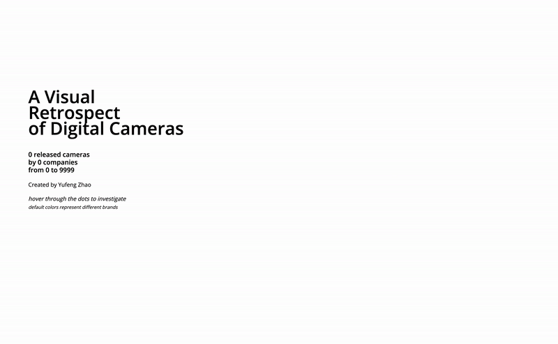

# A Visual Retrospect of Digital Cameras

## Description
This project is an interactive data story to present a visual retrospect of digital cameras over the past two decades. With detailed information of nearly 4000 cameras, the visualization of any factor(s) in their technical specification will show the temporal development of related technologies and markets under the animated timeline.

## Quick Access
-> [Link](https://digicam-retrospect.vercel.app/) (hosted on [Vercel](https://vercel.com))

## Types of Data Visualized
- Basic Information
  - Brand
  - Model Name
  - Release Year
- Primary Specifications
  - Sensor Resolution
  - Sensor Size
  - Sensor Type
  - Lens System
  - Weight
  - Body Size
- Secondary Specifications
  - Screen Resolution
  - Screen Size
  - ISO Range
  - Shutter Speed Range
  - Raw Support
  - Acquirement of Exposure Modes (Aperture/Shutter Priority)
  - Built-in Flash / External Flash Supports
  - USB Version
  - HDMI
  - Wi-Fi
  - Battery Type

## Source
All the data used in this project were scraped from [Digital Camera Database](https://www.digicamdb.com/). Details about my scraper scripts can be found [here](/scraper).

## Notes
This work is completed under the course [Critical Data & Visualization](https://github.com/leoneckert/critical-data-and-visualization-spring-2020) taught by [Leon Eckert](https://leoneckert.com/) at NYU Shanghai.
